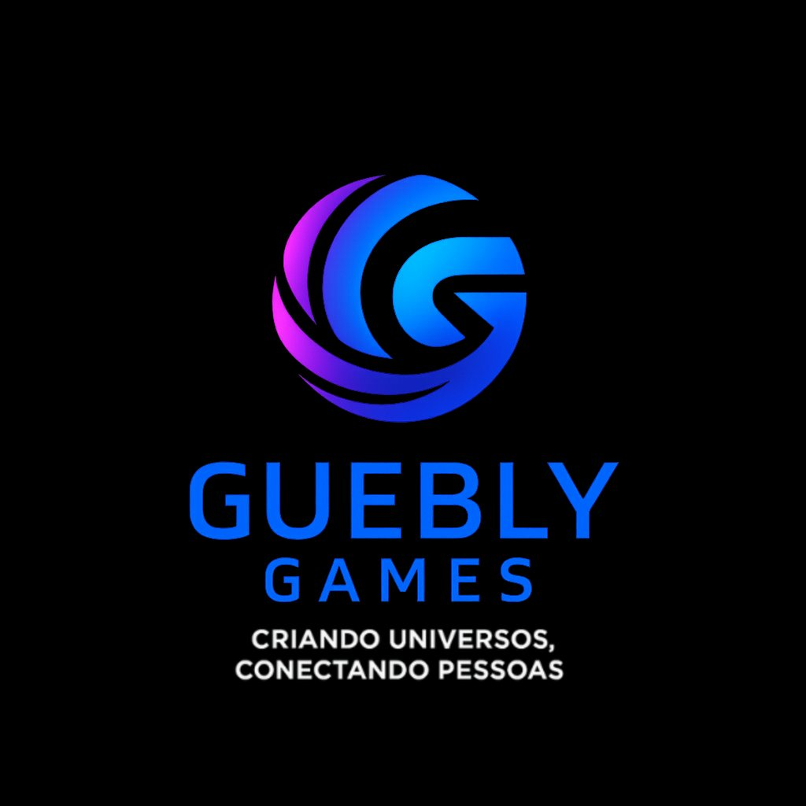

<div align="center">


<br/>
<br/>



<br/>
<br/>

# Memory Game

### A space-themed memory card game. Match the planets to win!

<br/>

[](https://developer.mozilla.org/en-US/docs/Web/JavaScript)
[](https://developer.mozilla.org/en-US/docs/Web/HTML)
[](https://developer.mozilla.org/en-US/docs/Web/CSS)
[](./LICENSE)
[](https://games.guebly.com.br)

<br/>


<br/>

[▶ Play Now](https://games.guebly.com.br) · [🌐 Website](https://games.guebly.com.br) · [🛒 Store](https://store.games.guebly.com.br) · [⚙️ Engine](https://engine.games.guebly.com.br) · [📁 GitHub](https://github.com/GueblyGames)

</div>

---

## Table of Contents

- [About the Game](#about-the-game)
- [Features](#features)
- [How to Play](#how-to-play)
- [Game Mechanics](#game-mechanics)
- [Planets](#planets)
- [Project Structure](#project-structure)
- [Technologies](#technologies)
- [Running Locally](#running-locally)
- [Contributing](#contributing)
- [About Guebly Games](#about-guebly-games)
- [License](#license)

---

## About the Game

**Memory Game** is a space-themed card matching game developed by **Guebly Games**. Navigate through the cosmos and find matching pairs of planets — from Earth and Mars to the mysterious Pluto — as fast as you can!

The game features:
- **20 cards** arranged in a **4×5 grid** (10 planet pairs)
- A **3D card flip animation** using pure CSS transforms
- A **scoring system** that rewards speed and efficiency
- A **timer** and **move counter** displayed in real time
- Full **mobile support** with responsive layout

No installation, no build step, no dependencies. Just open `index.html` in any modern browser.

---

## Features

| Feature | Description |
|---|---|
| Space theme | Immersive backgrounds, planet images, and rocket card backs |
| 3D flip animation | CSS `rotateY` transform for smooth card flips |
| Smart scoring | Score based on moves + time — lower is better |
| Player name | Personalized win screen with your name |
| Timer | Live MM:SS timer throughout the game |
| Move counter | Tracks how many pairs you've attempted |
| Preview on start | Cards reveal briefly at game start and hide again |
| Responsive design | Fully playable on mobile devices |
| Fisher-Yates shuffle | True randomization of the deck every game |
| Restart | Play again without leaving the game screen |

---

## How to Play

<div align="center">

</div>

<br/>

**1. Enter your name**
Open `index.html` in your browser. Type your name in the input field on the welcome screen.

**2. Start the game**
Click **PLAY**. The game board will appear with all 20 cards face-up for 3 seconds — memorize as many as you can!

**3. Flip cards**
After the preview, all cards flip face-down. Click any card to flip it over and reveal the planet.

**4. Find the pair**
Click a second card to try to match it. If both cards show the same planet — they stay flipped! If not, both cards flip back after 1 second.

**5. Win**
Match all 10 pairs to complete the game. Your final score, total moves, and elapsed time will be displayed on the victory screen.

**6. Play again**
Click **Play Again** to restart with a freshly shuffled deck, or go **Back Home** to enter a new name.

---

## Game Mechanics

### Card Flip

Each card is a 120×120px element (80×80px on mobile) with two faces:

- **Back face** — Rocket image on a cyan background (`#05c3ff`)
- **Front face** — Planet image on a dark blue background (`#101c2c`)

The flip uses a CSS 3D `rotateY(180deg)` transform with `preserve-3d` and `backface-visibility: hidden` for a realistic depth effect.

### Turn Logic

1. Player clicks a card → card flips face-up
2. Player clicks a second card → game locks (prevents further clicks)
3. If icons match → cards stay flipped, lock releases
4. If icons don't match → 1-second delay, both cards flip back, lock releases

### Scoring Formula

```
score = (matches × 1000) / ((moves + elapsed_seconds) / 4)
```

A higher score means you completed the game faster and with fewer pair attempts. The score is purely informational — the win condition is simply matching all pairs.

### Timer

The timer starts when the game board loads. It counts up in `MM:SS` format and stops when all pairs are matched. Seconds and minutes are tracked as individual digits for smooth display updates.

### Shuffle Algorithm

The deck is randomized using the [Fisher-Yates shuffle](https://en.wikipedia.org/wiki/Fisher%E2%80%93Yates_shuffle), guaranteeing uniform random distribution on every game start.

---

## Planets

The game features **10 celestial bodies** from our solar system — each appearing twice in the deck:

| Card | Name | Card | Name |
|:---:|---|:---:|---|
| ☀️ | Sun | 🌍 | Earth |
| 🌙 | Moon | ♂️ | Mars |
| ☿ | Mercury | ♃ | Jupiter |
| ♀️ | Venus | ♄ | Saturn |
| ⛢ | Uranus | ♇ | Pluto |

> All card backs show a 🚀 **Rocket** on a cyan background.

---

## Project Structure

```
MemoryGame/
│
├── index.html                   # Welcome / login screen
│
├── Interface/
│   ├── style.css               # Login page styles
│   ├── script.js               # Player name storage + win screen logic
│   └── Fonte/
│       └── Games.woff          # Custom "Games Regular" font
│
├── assets/
│   ├── index.html              # Main game board
│   ├── style.css               # Game board & card styles
│   │
│   ├── scripts/
│   │   ├── game.js             # Game state, logic & scoring
│   │   └── script.js           # DOM rendering & user interaction
│   │
│   ├── images/
│   │   ├── AstronautSpace.jpg  # Login background
│   │   ├── SpaceMoon.jpg       # Game background
│   │   ├── Foguete.png         # Rocket (card back)
│   │   ├── Terra.png           # Earth
│   │   ├── Lua.png             # Moon
│   │   ├── Marte.png           # Mars
│   │   ├── Mercúrio.png        # Mercury
│   │   ├── Vênus.png           # Venus
│   │   ├── Júpiter.png         # Jupiter
│   │   ├── Saturno.png         # Saturn
│   │   ├── Urano.png           # Uranus
│   │   ├── Plutão.png          # Pluto
│   │   └── Sol.png             # Sun
│   │
│   └── branding/
│       ├── icon.png            # Favicon
│       ├── gueblygames.png     # Guebly Games logo
│       ├── games.png           # Guebly Games white logo
│       └── slogan_icon.png     # Logo with slogan
│
├── GitHub/
│   ├── Foguete.png             # Rocket image for docs
│   ├── Website.png             # Game screenshot
│   └── Jogo Da Memória.gif     # Animated demo
│
├── README.md                    # English documentation (this file)
├── README.pt-BR.md              # Portuguese documentation
└── CONTRIBUTING.md              # Contribution guidelines
```

---

## Technologies

| Technology | Usage |
|---|---|
| **HTML5** | Semantic markup for login screen and game board |
| **CSS3** | 3D card flip (`rotateY`), CSS Grid layout, transitions, responsive breakpoints |
| **Vanilla JavaScript** | Game logic, DOM manipulation, timer, shuffle algorithm |
| **localStorage** | Persists player name across pages |
| **CSS `preserve-3d`** | Realistic 3D flip depth effect |
| **`backface-visibility: hidden`** | Hides the back face during 3D rotation |
| **Custom WebFont** | `Games.woff` — "Games Regular" font for branding |

No external libraries, no npm, no build tools. Pure web standards.

---

## Running Locally

Since this is a pure frontend project with no server-side dependencies, running it is as simple as:

```bash
# Clone the repository
git clone https://github.com/GueblyGames/JogoDaMemoria.git

# Navigate to the project folder
cd JogoDaMemoria

# Open in your browser
open index.html       # macOS
start index.html      # Windows
xdg-open index.html   # Linux
```

Or simply double-click `index.html` in your file explorer.

> **Tip:** For the best experience, use a local server to avoid any CORS restrictions with local images. You can use the [Live Server](https://marketplace.visualstudio.com/items?itemName=ritwickdey.LiveServer) extension for VS Code.

---

## Contributing

Contributions are welcome! Please read [CONTRIBUTING.md](./CONTRIBUTING.md) for the full guide.

**Quick start:**

```bash
# 1. Fork the repository on GitHub
# 2. Clone your fork
git clone https://github.com/YOUR_USERNAME/JogoDaMemoria.git

# 3. Create a feature branch
git checkout -b feat/my-feature

# 4. Make your changes, then commit
git commit -m "feat: describe your change"

# 5. Push and open a Pull Request
git push origin feat/my-feature
```

**Suggestions for contribution:**
- Add new planet/celestial body cards (Neptune, comets, asteroids)
- Add difficulty levels (easy: 3×4, medium: 4×5, hard: 5×6)
- Add background music and sound effects
- Add a global leaderboard
- Add card themes (animals, countries, etc.)
- Improve accessibility (keyboard navigation, screen reader support)

---

## About Guebly Games

<div align="center">


<br/>
<br/>

**Guebly Games** is a Brazilian game studio dedicated to creating fun, accessible, and creative web games.

Beyond games, Guebly builds its own **game engine** and a **digital store** for indie developers — an ecosystem for the next generation of game creators.

<br/>

| | |
|---|---|
| 🌐 **Website** | [games.guebly.com.br](https://games.guebly.com.br) |
| 🛒 **Store** | [store.games.guebly.com.br](https://store.games.guebly.com.br) |
| ⚙️ **Game Engine** | [engine.games.guebly.com.br](https://engine.games.guebly.com.br) |
| 💻 **GitHub** | [github.com/GueblyGames](https://github.com/GueblyGames) |
| 📧 **Contact** | [contato@guebly.com.br](mailto:contato@guebly.com.br) |

<br/>

*"Criando Universos, Conectando Pessoas"*
*(Creating Universes, Connecting People)*

<br/>


</div>

---

## License

```
MIT License

Copyright (c) 2026 Guebly Games

Permission is hereby granted, free of charge, to any person obtaining a copy
of this software and associated documentation files (the "Software"), to deal
in the Software without restriction, including without limitation the rights
to use, copy, modify, merge, publish, distribute, sublicense, and/or sell
copies of the Software, and to permit persons to whom the Software is
furnished to do so, subject to the following conditions:

The above copyright notice and this permission notice shall be included in all
copies or substantial portions of the Software.

THE SOFTWARE IS PROVIDED "AS IS", WITHOUT WARRANTY OF ANY KIND, EXPRESS OR
IMPLIED, INCLUDING BUT NOT LIMITED TO THE WARRANTIES OF MERCHANTABILITY,
FITNESS FOR A PARTICULAR PURPOSE AND NONINFRINGEMENT. IN NO EVENT SHALL THE
AUTHORS OR COPYRIGHT HOLDERS BE LIABLE FOR ANY CLAIM, DAMAGES OR OTHER
LIABILITY, WHETHER IN AN ACTION OF CONTRACT, TORT OR OTHERWISE, ARISING FROM,
OUT OF OR IN CONNECTION WITH THE SOFTWARE OR THE USE OR OTHER DEALINGS IN THE
SOFTWARE.
```

---

<div align="center">

Made with ❤️ by [Guebly Games](https://games.guebly.com.br)


</div>
